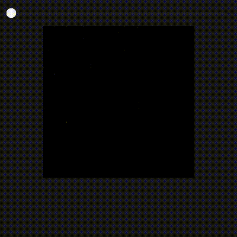

## How to Use

### Build it yourself

1. **Install Go >= 1.19**

2. **Install dependencies**
     - **Debian / Ubuntu**: 
     ```bash 
     sudo apt-get install gcc libgl1-mesa-dev xorg-dev
     ```
     - **Fedora**: 
     ```bash : 
     sudo dnf install gcc libXcursor-devel libXrandr-devel mesa-libGL-devel libXi-devel libXinerama-devel libXxf86vm-devel
     ```
     - **Arch Linux**: 
     ```bash 
     sudo pacman -S xorg-server-devel libxcursor libxrandr libxinerama libxi
     ```

     - **Solus**: 
     ```bash 
     sudo eopkg it -c system.devel mesalib-devel libxrandr-devel libxcursor-devel libxi-devel libxinerama-devel
     ```
     - **openSUSE**: 
     ```bash 
     sudo zypper install gcc libXcursor-devel libXrandr-devel Mesa-libGL-devel libXi-devel libXinerama-devel libXxf86vm-devel
     ```
     - **Void Linux**: 
     ```bash 
     sudo xbps-install -S base-devel xorg-server-devel libXrandr-devel libXcursor-devel libXinerama-devel libXxf86vm-devel
     ```
     - **Alpine Linux**: 
     ```bash 
     sudo apk add gcc libxcursor-dev libxrandr-dev libxinerama-dev libxi-dev linux-headers mesa-dev
     ```
     - **NixOS**: 
     ```bash 
     nix-shell -p libGL pkg-config xorg.libX11.dev xorg.libXcursor xorg.libXi xorg.libXinerama xorg.libXrandr xorg.libXxf86vm
     ```

3. **Run the Program**:
   ```bash
   go run main.go
   ```

4. **Review Output**:
   - Drag and drop your file into the application and move the slider to see the heatmap change

